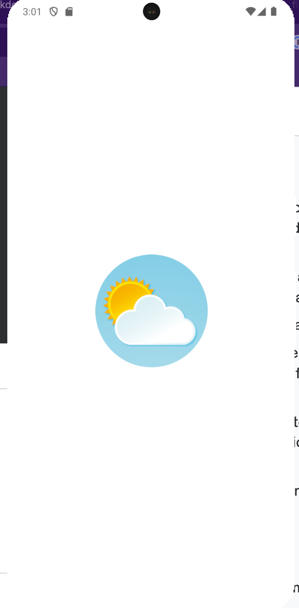

# Clima App

### [Link to flutter tutorial](https://www.udemy.com/course/flutter-bootcamp-with-dart/?couponCode=OF53124)

## Overview:
- The Clima application provides a user with the current weather for their location and allows the user to type in any city they want to get the most up to date weather. 

## What I learn about flutter/dart with project: 
- Making API calls
- Accessing physical device GPS data
- Exception handling 
- Null aware operator 
- Future, Async & Await
- Manipulating JSON data

## Screenshots: 

  

## Installation/Running steps :computer: :
### :warning: To run project you need a OpenWeather API key :warning:

- [Link to creating OpenWeather account and API key](https://openweathermap.org/appid)

### Adding environment file
- Create `.env` file in the root of the project 
- Insert this `API_KEY='<openweather_api_key>'` into file
- Replace <> tag with your open weather api key

### Running project
- Add [Flutter](https://docs.flutter.dev/get-started/install) to your machine
- Open this project folder with Terminal/CMD and run `flutter packages get`
- Run `flutter run` to build and run the debug app on your emulator/phone
